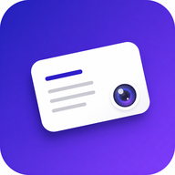
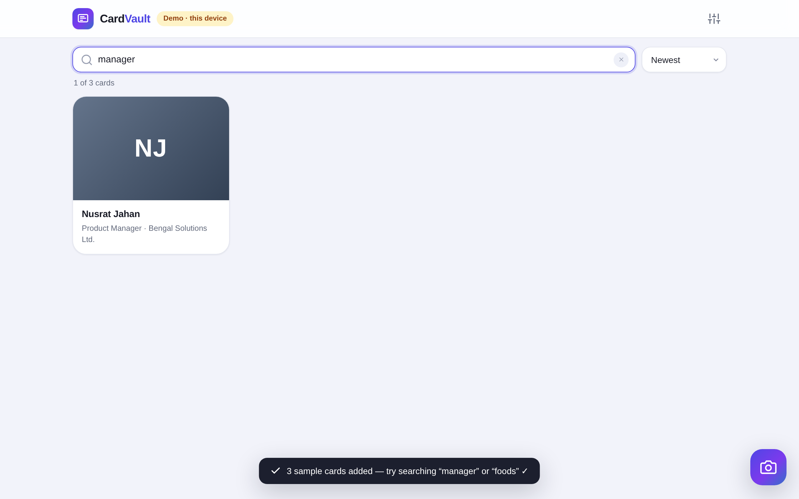
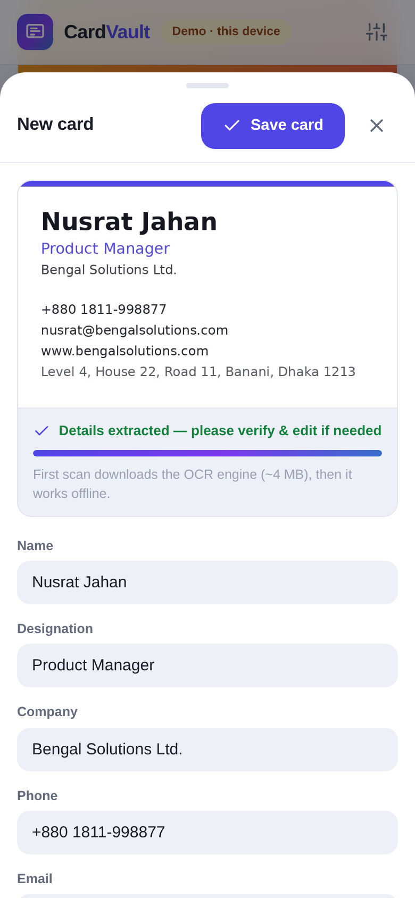
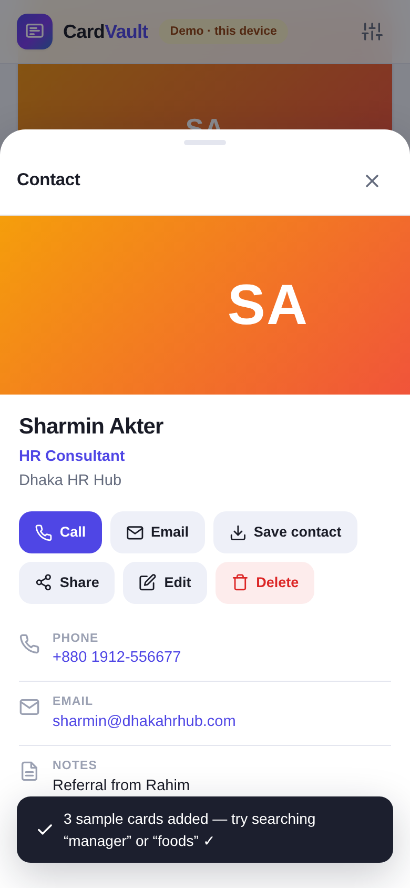

<div align="center">



# CardVault

**Scan business cards with your camera. Find any contact in seconds.**

A free, open-source, installable web app (PWA) that turns a pile of
visiting cards into a searchable contact library — with **on-device OCR**,
cloud sync, and **vCard export** to your phone's contacts.

[](LICENSE)
[](CONTRIBUTING)

[](https://cardvault-app.surge.sh)

</div>

<p align="center">
  
</p>

<p align="center">
  
  &nbsp;
  
</p>

---

## ✨ Features

| | |
|---|---|
| 📷 **Camera capture** | Live viewfinder with a card guide frame, front/back flip, and flashlight — or pick a photo from your gallery |
| 🔍 **On-device OCR** | Tesseract.js reads the card *on your phone* — no server, no API key, no per-scan cost. Details are pre-filled for you to confirm |
| 🧠 **Smart field parsing** | Name, designation, company, phone, email, website and address are auto-detected from the scanned text |
| ⚡ **Instant search** | Search by **name, company, designation**, email, phone or notes — phone numbers match even without `+` or spaces |
| ☁️ **Accounts & cloud sync** | **Login required** — email + password or one-tap **Google / Apple** sign-in (Supabase Auth, passwords hashed server-side). Cards sync to any device; Row-Level Security means *only you* can see them, and card photos are stored in your project's private storage |
| 📇 **Device contacts** | Import people straight from your phone's contact list (Contact Picker API, Android) and save any card back to contacts with one tap |
| 🧪 **Demo mode** | Local development only: try everything with zero setup before connecting Supabase — live users always sign in |
| 👤 **Save to contacts** | One tap downloads a standard **vCard (.vcf)** — with the card photo embedded — that opens straight in your phone's contacts app |
| 📤 **Bulk export** | Export every contact as one `.vcf` file, or a JSON backup |
| 📴 **Offline-first PWA** | Install it to your home screen; the app shell and OCR engine keep working without a network |
| 🌙 **Dark mode** | Follows your system theme automatically |
| 🔐 **Private by design** | Images live in a *private* storage bucket served via short-lived signed URLs; the anon key is public-safe behind RLS |

## 🌐 Live demo

Try it right now at **https://cardvault-app.surge.sh** — create a free account
(email confirmation) and start scanning. Works in any modern browser.

## 📱 Install on Android (native app)

CardVault ships as a **standalone Android app** (built with
[Capacitor 7](https://capacitorjs.com) — see [`native/`](native/)): the entire
app is bundled inside the APK and runs in the app's own WebView.

- ⬇️ **Download:** [CardVault-v1.3.0.apk](https://github.com/saidurhridoy/CardVault/releases/download/v1.3.0/CardVault-v1.3.0.apk) (~4.5 MB)
- **Android 7.0+** · no browser needed, no browser UI — it's a real app with
  its own icon, splash screen and camera permission prompt
- Works fully offline for browsing previously synced cards; internet is only
  needed for sign-in and cloud sync (Supabase)
- App shell + libraries (supabase-js, tesseract.js) are bundled — nothing is
  loaded from a CDN at startup
- The OCR engine files download on first scan and are cached on-device

The website (below) remains the always-up-to-date web version; the APK is
updated per release.

## 🚀 Quick start

```bash
git clone https://github.com/YOUR_USERNAME/cardvault.git
cd cardvault

# 1. connect your free Supabase project (2 minutes) → docs/SETUP.md
#    then edit js/config.js with your URL + anon key

# 2. serve locally (a server is required — ES modules don't run from file://)
npm start          # or: python3 -m http.server 3000
```

Open http://localhost:3000 — in development you can hit **"Try demo mode"**
even before configuring Supabase (demo is hidden once the app is configured:
real users must sign in).

> Full walkthrough: **[docs/SETUP.md](docs/SETUP.md)** · Publishing to GitHub + free hosting: **[docs/PUBLISH.md](docs/PUBLISH.md)**

## 🏗️ How it works

```
 📷 Camera  ─▶  🖼️ JPEG (downscaled ≤1600px)  ─▶  🔍 Tesseract.js OCR (in-browser)
                                                        │
                     ✏️ you confirm/edit           ◀─  🧠 heuristic field parser
                           │                              (name / title / company /
                           ▼                                phone / email / web / address)
                    ☁️ Supabase Postgres + Storage  ─▶  ⚡ client-side search
                                                       📤 vCard export
```

**Stack** — vanilla JS (no framework, no build step) · Supabase (auth + Postgres + storage, free tier) · Tesseract.js via CDN · IndexedDB for demo mode · hand-rolled service worker.

## 📁 Project structure

```
cardvault/
├── index.html               # app shell (single page)
├── manifest.webmanifest     # PWA manifest (installable, shortcut)
├── sw.js                    # service worker — offline app shell + CDN cache
├── css/style.css            # all styling (light + dark)
├── js/
│   ├── config.js            # ⚙️ the only file you must edit (Supabase keys)
│   ├── app.js               # views, camera, review flow, search, settings
│   ├── db.js                # data layer: Supabase cloud + IndexedDB demo mode
│   ├── ocr.js               # Tesseract wrapper + field parser (unit-tested)
│   ├── vcard.js             # vCard 3.0 generation
│   └── util.js              # DOM/format/file helpers
├── supabase/schema.sql      # tables + RLS + storage bucket (run once)
├── samples/sample-card.png  # try OCR on this!
├── test/parser.test.mjs     # npm test
├── docs/SETUP.md            # Supabase + configuration guide
└── docs/PUBLISH.md          # GitHub + free hosting guide
```

## 🧪 Tests

```bash
npm test          # 29 parser assertions against realistic card layouts

# optional full UI smoke test (real browser, demo mode, real OCR):
npm i -D playwright-core && npx playwright-core install chromium
npm run test:ui   # 15 end-to-end steps: capture → OCR → save → search → edit → delete → export
```

## 🔐 Security model

- The **anon key** in `js/config.js` is *designed to be public* — like a username, not a password.
- **Row Level Security** on `cards` restricts every query to `auth.uid() = user_id`.
- Card photos sit in a **private** bucket; the app reads them via 7-day **signed URLs**.
- **Never** commit the `service_role` key — it bypasses RLS. (It isn't needed anywhere in this app.)

## 🗺️ Roadmap

- [ ] Batch scan (capture several cards in a row)
- [ ] More OCR languages (Bengali, Hindi, Arabic…)
- [ ] Duplicate detection
- [ ] Tags & follow-up reminders
- [ ] CSV export

Contributions are welcome — open an issue or a PR!

## 📄 License

[MIT](LICENSE) — free for personal and commercial use.
